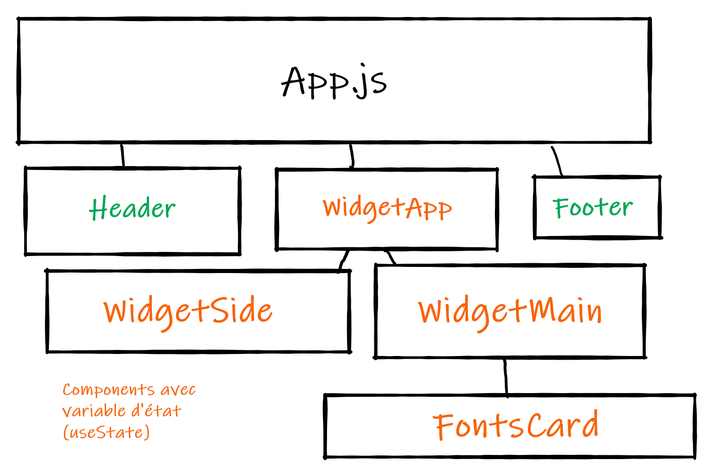

# Projet Alyra Google Fonts Widget
**Team verte :** Pyrénam, Ton, Diego et Raphael

**Site :** [NetLify](https://alyra-google-fonts-widget-green-team.netlify.app/)
## 03/05/2021
### Création de l'App
 `npx create-react-app alyra-google-fonts-widget`
### Suppression des fichiers et lignes de codes inutiles  
  -  **Dans src :**
      - setupTests.js
      - App.test.js
      - logo.svg
      - vider le App.css
      - le contenu de App.css (import logo, le contenu de return)
  - **Dans public :**
    - logo192.png
    - logo512.png
 
### Ajoute de bootstrap
`yarn add bootstrap@next`

**Importation dans App.js :** 
```js
import "bootstrap/dist/css/bootstrap.css"
```

### Création des components et du site statique
**Architecture du site :**   
  

Construction du design avec bootstrap

### Variables d'état (useState)
**Initiation dans WidgetApp.js :**
- filter (select)
- text (text area)
- size (slider)
 
Utilisation de `size` dans `<FontsCard />` : 
```html
<p style={{ fontSize: `${size}px` }}>{text}</p>
```
-------
## 04/05/21
### Installation de axios
`yarn add axios`
Puis dans le code :  
```js
import axios from 'axios'
```
### Utilisation de l'API Google Fonts
- Comprendre l'objet JSON
- Utilisation de sort dans la requête (popularity, ...)

### Mise en place de .env.local
Dans un fichier `.env.local` nativement présent dans le `.gitignore` d'un CRA :  
REACT_APP_GOOGLE_API=*******************

`process.env.REACT_APP_FONTS_API` permet de récupérer la clé API dans le fichier .env.local  

--------  

### useEffect & useReducer adapté à la récupération de données
Comme pour les autres variables d'états, le useReducer est définit dans le `<WidgetApp />` :  
```js
  const [state, dispatch] = useReducer(dataReducer, {
    // Etat initial du state
    data: [],
    loading: false,
    error: false,
    url: `https://www.googleapis.com/webfonts/v1/webfonts?key=${process.env.REACT_APP_FONTS_API}&sort=alpha`
  })
  ```

On utilise maintenant un **useEffect** qui va altérer **notre objet state** via la fonction **dispatch :**  
```js
  useEffect(() => {
    const dataFetching = async () => {
      dispatch({ type: "FETCH_INIT" })
      try {
        let response = await axios(url)
        dispatch({ type: "FETCH_SUCCESS", payload: response })
      } catch (error) {
        dispatch({ type: "FETCH_ERROR", payload: error })
      }
    }
    dataFetching()
  }, [url])
```
La fonction **dataReducer** correspondant à **dispatch** est définit dans un fichier `reducers.js` dans **src** que l'on import dans notre `<WidgetApp />`
```js
const dataReducer = (state, action) => {
  switch (action.type) {
    case "FETCH_INIT":
      return {
        ...state,
        loading: true,
        error: false,
      }
    case "FETCH_ERROR":
      return {
        ...state,
        loading: false,
        error: action.payload.message
      }
    case "FETCH_SUCCESS":
      return {
        ...state,
        loading: false,
        error: false,
        data: action.payload.data.items.slice(0, 10)
      }
    case "CHANGE_FETCH":
      return {
        ...state,
        url: `https://www.googleapis.com/webfonts/v1/webfonts?key=${process.env.REACT_APP_FONTS_API}&sort=${action.payload}`
      }
    default:
      throw new Error(`Il y a eu une erreur dans le dispatch: ${action.type}`)
  }
}
```
Le `case "CHANGE_FETCH":` est expliqué plus bas.


### Implémentation de la police dans les cards
Les polices dans chaques *cards*  de `<FontsCard />` on été implémentées avec l'option proposée par GoogleFonts : @import :
```html
<FontsCard />

  <style>
        @import url('https://fonts.googleapis.com/css2?family={familyRequest}&display=swap');
  </style>
  <p style={{ fontSize: `${size}px`, fontFamily: `'${elem.family}', cursive` }}>{text}</p>
``` 
**familyRequest** correspond au nom de la famille sans espace (avec des +). Puis le style CSS est implémenté à l'aide de l'attribut *style*.
### Déclanchement de nouvelles requêtes via la liste déroulante
La liste déroulante doit deshormais fournir deux informations : 
- Le nom du filter (les plus populaires, récents, ...)
- L'attribut à ajouter à notre requête http (date, popularity, ...)

Pour cela l'ID, la value et le contenu de la balise ont été utilisé : 
```html
Chaque option était définit comme cela :

  <option id="popularity" value="popularity">Les plus populaires</option>
```
Pour récupérer ces informations via la fonction du `<select>` :
```js
  const handleChangeFilter = (e) => {
    // Attribut pour la requête
    dispatch({ type: "CHANGE_FETCH", payload: e.target.value })

    // Nom du filtre  
setFilter(document.getElementById(e.target.value).textContent)
  }
```
-------
## 05/05/21
### Mise en place de loading & error
Comme dans l'exemple du cours : 
```js
      {loading && <p className="fs-1">Chargement...</p>}
      {error && <p className="alert alert-danger">Il y a eu une erreur : {error}</p>}
```
### Mise en place de la clé dans Netify
**Advanced build settings** => New variable

--------
## 07/05/21 - mise en place des favoris
### Variable *favorite*
Initialisation de la variable d'état dans `<WidgetApp />`  
```js
  const [favorite, setFavorite] = useState([])
```
Modification de le l'état dans `<FontsCard />` (bouton cliquable on/off avec une limite de 10 favoris) :
```js
  const handleFavButton = (elem) => {
    if (favorite.includes(elem.family)) {
      setFavorite(favorite.filter((el) => el !== elem.family))
    } else {
      setFavorite([...favorite, elem.family])
    }
  }
```
### Modification du *dataReducer*
Notre **disptach** était adapter à une URL avec l'option pour trier nos 10 premiers résultats. Cependant pour récupérer nos favoris on devait appliquer un filtre **sur l'ensemble de l'objet** contenant les polices : 
```js
case "FETCH_SUCCESS":
      let fetchedData = []
      if (state.url.length < 95) {
        // remplaçable par un .filter
        for (let elem of action.payload.data.items) {
          if (action.favorite.includes(elem.family)) {
            fetchedData.push(elem)
          }
        }
      } else {
        fetchedData = action.payload.data.items.slice(0, 10)
      }
      return {
        ...state,
        loading: false,
        error: false,
        data: fetchedData
      }
```
Et donc également changer notre requête http : 
```js
case "CHANGE_FETCH":
      let newUrl = `https://www.googleapis.com/webfonts/v1/webfonts?key=${process.env.REACT_APP_FONTS_API}&sort=${action.payload}`
      if (action.payload === "favorite") {
        newUrl = `https://www.googleapis.com/webfonts/v1/webfonts?key=${process.env.REACT_APP_FONTS_API}`
      }
      return {
        ...state,
        url: newUrl
      }
```
### Mise en place du Local Storage
Un useEffect pour enregistrer les favoris :
```js
  useEffect(() => {
    window.localStorage.setItem("my-favorites", JSON.stringify(favorite))
  }, [favorite])
```
Et l'initialisation de la variable d'état :
```js
// la fonction (()=>...) améliore t-elle la performance ? (Lazy initial state)
  const [favorite, setFavorite] = useState(() => JSON.parse(localStorage.getItem("my-favorites")) || [])
```

## 09/05/21
### Utilisation des .filter
Dans `reducers.js` on remplace : 
```js
for (let elem of action.payload.data.items) {
  if (action.favorite.includes(elem.family)) {
    fetchedData.push(elem)
     }
  }
```
par :
```js
fetchedData = action.payload.data.items.filter((elem) => action.favorite.includes(elem.family))
```

### Disparition des favoris lors du décochage dans le menu favoris 
On veux que, dans le menu "Mes favoris", les polices disparaisse lorsque nous les décochons. On utilise le useEffect étant déclanché par `[favorite]` (`<WidgetApp />`) : 
```js
if (filter === 'Mes favoris') {
      dispatch({ type: "CHANGE_FAVORITE", favorite })
    }
```
La fonction est appellée uniquement si on est dans le menu "Mes favoris". Et on ajoute une nouvelle action au **reducer :** 
```js
case "CHANGE_FAVORITE":
      return {
        ...state,
        data: state.data.filter((elem) => action.favorite.includes(elem.family))
      }
```
### Focus sur les deux warning lié à useEffect
*React Hook useEffect has a missing dependency: 'favorite'. Either include it or remove the dependency array  react-hooks/exhaustive-deps*  
Pour ignorer ce warning on peut ajouter au dessus du tableau de dépendence : 
```js
// eslint-disable-next-line
```
Pour évité de mettre cette ligne de commentaires à chaque fin du useEffect, on peut placer cette ligne au dessus du components `<WidgetApp />` :
```js
/* eslint-disable */
```

## 10/05/21
### Simplification du code pour l'affichage des polices
L'affichage des *cards polices* se fait avec le **.map** dans `<WidgetMain />` :
```js
{data.map((elem) => {
    return <FontsCard key={elem.family} favorite={favorite} setFavorite={setFavorite} elem={elem} text={text} size={size} />
      })}
```
On ajoute un **.slice(0,10)** pour éviter de traiter *data* en amont et éviter un affichage d'un grand nombre de polices :
```js
{data.slice(0, 10).map((elem) => {...}
)}
```

### Ajout d'une fonction recherche 
La recherche doit se faire sur l'ensemble du tableau de police, il faut donc stocker dans un objet l'ensemble du tableau. Ce dernier est appelé **items** et est initié avec un tableau vide (voir `<WidgetApp />`, **ligne 24**).  
Un bouton de recherche est implémenté dans `<WidgetSide />`, il sert à déclancher le mode recherche (change le bouton en bar de recherche) :  
```html
      {state.isSearch === false ? <button onClick={handleDisplaySearch} className="btn btn-danger">Rechercher une police</button > : <SearchBar state={state} dispatch={dispatch} />}
```
La fonction associée permet de changer la variable *isSearch* & la variable *filter* :  
```js
 const handleDisplaySearch = (e) => {
    dispatch({ type: "DISPLAY_SEARCH" })
    setFilter('Recherche')
  }
```
**"DISPLAY_SEARCH" :**  change l'url que si l'on est dans "Mes favoris"
```js
    case "DISPLAY_SEARCH":
      let newUrl1 = state.url
      if (state.filter === "Mes favoris") {
        newUrl1 = `https://www.googleapis.com/webfonts/v1/webfonts?key=${process.env.REACT_APP_FONTS_API}&sort=alpha`
      }
      return {
        ...state,
        isSearch: !state.isSearch,
        url: newUrl1
      }
```
**Fonctionnement de la bar de recherche**  
Elle est définit dans un nouveau components `<SearchBar />` retournant une bar de recherche : 
```js
const SearchBar = ({ state, dispatch }) => {
  const handleChangeSearch = (e) => {
    dispatch({ type: "CHANGE_FILTER", payload: e.target.value })
  }

  return (
    <div className="input-group mb-3">
      <input onChange={handleChangeSearch} type="text" className="form-control" placeholder="Tapez votre recherche" aria-label="Recipient's username" aria-describedby="button-addon2" />
    </div>
  )
}
```  
Et on peut voir que les modifications sur cette bar de recherche active la fonction **dispatch**.  
**"CHANGE_FILTER" :** le filtrage se fait sur l'objet **items**
```js
    case "CHANGE_FILTER":
      let displayedData = state.items.filter((elem) => elem.family.toLowerCase().includes(action.payload.toLowerCase()))
      return {
        ...state,
        searchFilter: action.payload,
        data: displayedData
      }
```
Il y a donc une modification de la liste de police à afficher sans passer par un useEffect.

Stocker l'objet contenant toute les polices est une bonne pratique pour la performance ?  


## A faire
- Utiliser les componants dédiés aux polices  
[React Google Font Loader](https://github.com/jakewtaylor/react-google-font-loader)

## Pour aller plus loin
- dans l'option recherche
  - besoin de mettre un cancel (abord fetch)
